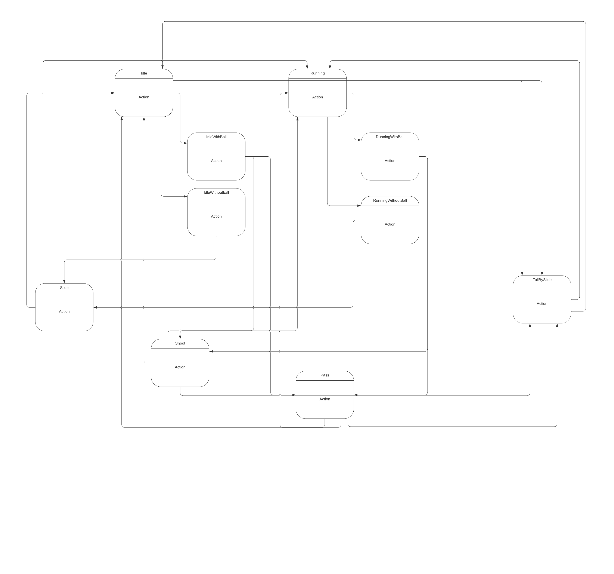

# ComputerGraphicsProject

DONE
	Some features added : 
		Dribbling
		Jump
		Movement
		Pass
		Shoot
		Slide

DOING
	Bug fixing

TODO
	Animations

challenges: dribbling correctly

FSM:

21/03/2022:
	Finite state machine  added to control player.
	Some animations added.(idle, runnning, shoot,pass,slide and fall)
	Some bugs fixed.
	
04/04/2022:
	Added goalkeeper.
	Working on goalkeeper artificial intelligence.
	I'm considering using a decision tree for artificial intelligence.
	Added a tree for experimentation.
	Added goalkeeper animations.