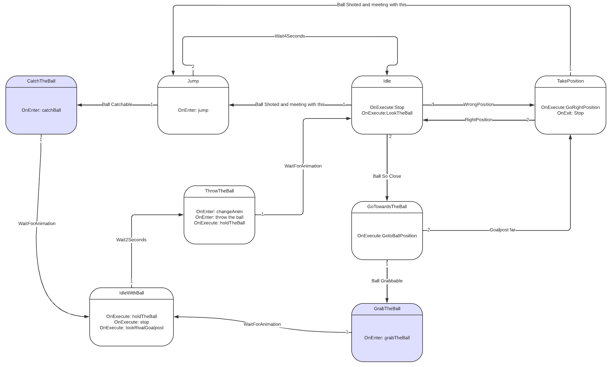

# ComputerGraphicsProject

Goalkeeper AI Test :
https://www.youtube.com/watch?v=enlmuBypcPo

DONE
	Some features added : 
		Jump
		Movement
		Pass
		Shoot
		Slide
		Animations

DOING
	Bug fixing
	Goalkeeper AI
	Dribbling
TODO
	Footballer AI

challenges: dribbling correctly

FSM:
Footballer:

Goalkeeper:

 
21/03/2022: 
	Finite state machine  added to control player. 
	Some animations added.(idle, runnning, shoot,pass,slide and fall) 
	Some bugs fixed. 
	 
04/04/2022: 
	Added goalkeeper. 
	Working on goalkeeper artificial intelligence. 
	I'm considering using a decision tree for artificial intelligence. 
	Added a tree for experimentation. 
	Added goalkeeper animations. 
	 
05/04/2022: 
	Refactoring  
	Almost all animations added 
	Better goalkeeper ai 
	Better interactions between objects like goalkeeper catches and throws the ball  (still not so good, there are some visual distortion) 
 
Situation Assessment :
	I learned a lot with this project, but still there are some problems in the application part, I think I can solve many problems in 1-2 weeks. I rewrote my code because it had become unmaintainable because I didn't have enough knowledge when start.
